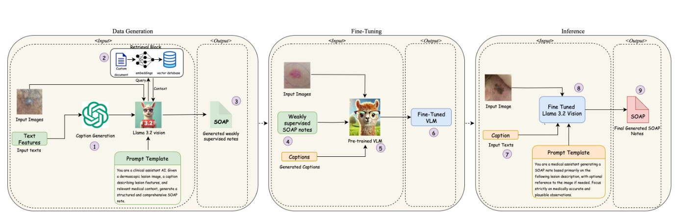

# 🩺 Skin-SOAP: Weakly Supervised Multimodal Framework for Structured SOAP Notes  

  


## 🌟 Overview  
**Skin-SOAP** is a weakly supervised multimodal framework for generating structured **SOAP (Subjective, Objective, Assessment, Plan)** notes from limited dermatologic inputs. It integrates lesion images, sparse clinical text, and retrieval-augmented knowledge to produce clinically grounded documentation with minimal manual annotation effort.

Manual SOAP note generation is time-consuming, contributes to physician burnout, and slows clinical workflows. Skin-SOAP automates this process, reducing annotation needs while maintaining high clinical fidelity, readability, and completeness.  

Key features:
- 🔹 Weakly supervised learning from lesion images + sparse text  
- 🔹 Retrieval-Augmented Generation for domain-grounded outputs  
- 🔹 Fine-tuned Vision-LLaMA 3.2 with Parameter-Efficient Fine-Tuning (QLoRA)  
- 🔹 Novel evaluation metrics: **MedConceptEval** & **Clinical Coherence Score (CCS)** for clinical and semantic quality  

---

## 🚀 Project Highlights  
- 📊 **Dataset**: PAD-UFES-20 (2,298 dermoscopic images, 1,641 lesions, 1,373 patients; 6 lesion types: BCC, MEL, SCC, ACK, SEK, NEV). Each lesion is linked to 26 structured clinical features.  
- 📝 **Caption Generation**: GPT-3.5 converts structured features into coherent lesion descriptions.  
- 📚 **Retrieval-Augmented Knowledge**: Context retrieved from authoritative sources (e.g., NCI, NHS, American Cancer Society) is combined with lesion captions to ground the model’s output.  
- 🤖 **Model**: Vision-LLaMA 3.2 fine-tuned using QLoRA (rank=8, α=16, bf16 mixed precision) on synthesized SOAP notes.  
- ⏱️ **Training Runtime**: Data generation ~9 hours; fine-tuning ~1.5 hours on NVIDIA A100 80GB.  

---

## 🏗️ Framework Architecture  

**Phase 1: Data Generation**  
- Generate lesion captions from structured features with GPT-3.5  
- Retrieve semantically relevant passages from a curated vector database (ChromaDB)  
- Feed image + caption + retrieved context into Vision-LLaMA 3.2 to synthesize weakly supervised SOAP notes  

**Phase 2: Fine-Tuning**  
- Parameter-Efficient Fine-Tuning (QLoRA) on Vision-LLaMA 3.2  
- Supervised Fine-Tuning (SFT) with synthesized multimodal input-output pairs  

**Phase 3: Inference**  
- Given a new lesion image and clinical features, generate a structured SOAP note automatically  

---
## 🖼️ Framework Pipeline  

Below is the end-to-end Skin-SOAP pipeline, from weakly supervised data generation to fine-tuning and inference:




## 📈 Evaluation  

### 🔬 Quantitative Metrics  
- **MedConceptEval**: Semantic alignment between SOAP sections and curated clinical concept sets. Statistically significant effect of SOAP section (p=0.022), consistent performance across lesion types (p=0.268).  
- **Clinical Coherence Score (CCS)**: Measures semantic alignment between the generated SOAP note and its source caption. Model significantly outperforms human-written notes in CCS (p<0.001).  

### 👩‍⚕️ Qualitative Metrics  
- **Flow-Judge-v0.1** evaluation on structure, readability, completeness, and medical relevance. Skin-SOAP achieved a perfect **20/20**, outperforming GPT-4o, Claude, and Janus Pro baselines (18–19/20).  

---

## 🏆 Results  
- Comparable or superior performance to GPT-4o, Claude, and Janus Pro on key metrics (ROUGE, METEOR, CHRF++, ClinicalBERT F1).  
- High-quality SOAP note examples showing correct section-level reasoning and structured outputs.  

---

## ⚠️ Limitations and Future Work  
- Dependent on accuracy of retrieved knowledge (risk of bias or incompleteness)  
- Evaluated on a single dataset; limited large-scale validation  
- Potential hallucinations with ambiguous inputs  

**Next Steps**:  
- 🔄 Expand to more diverse, multi-source datasets  
- 🧑‍⚕️ Incorporate human-in-the-loop refinement strategies  
- 🧠 Develop benchmarks capturing longitudinal clinical reasoning and decision support  

---

## 📂 Repository Structure  

```
├── notebooks/                 # Jupyter notebooks for data generation and fine-tuning
├── data/                      # Sample lesion images & structured metadata (if allowed)
├── models/                    # Vision-LLaMA 3.2 fine-tuning configs
├── evaluation/                # Scripts for MedConceptEval and CCS
├── results/                   # Quantitative and qualitative evaluation outputs
└── README.md                  # This file
```

---

## 📑 Citation  

If you use this work, please cite:  

```
@article{kamal2025skinsoap,
  title={Skin-SOAP: A Weakly Supervised Multimodal Framework for Structured SOAP Notes},
  author={Kamal, Sadia and Oates, Tim and Wan, Joy},
  journal={arXiv preprint arXiv:2508.05019},
  year={2025}
}
```

---

## 🔗 Links  
- [📄 ArXiv Paper](https://arxiv.org/abs/2508.05019v1)  
- [📊 Slides (Skin-SOAP Presentation)](link to your .pptx in repo)
  
## Contact

For questions about this code, please open an issue on GitHub or email sadia1402@umbc.edu.
